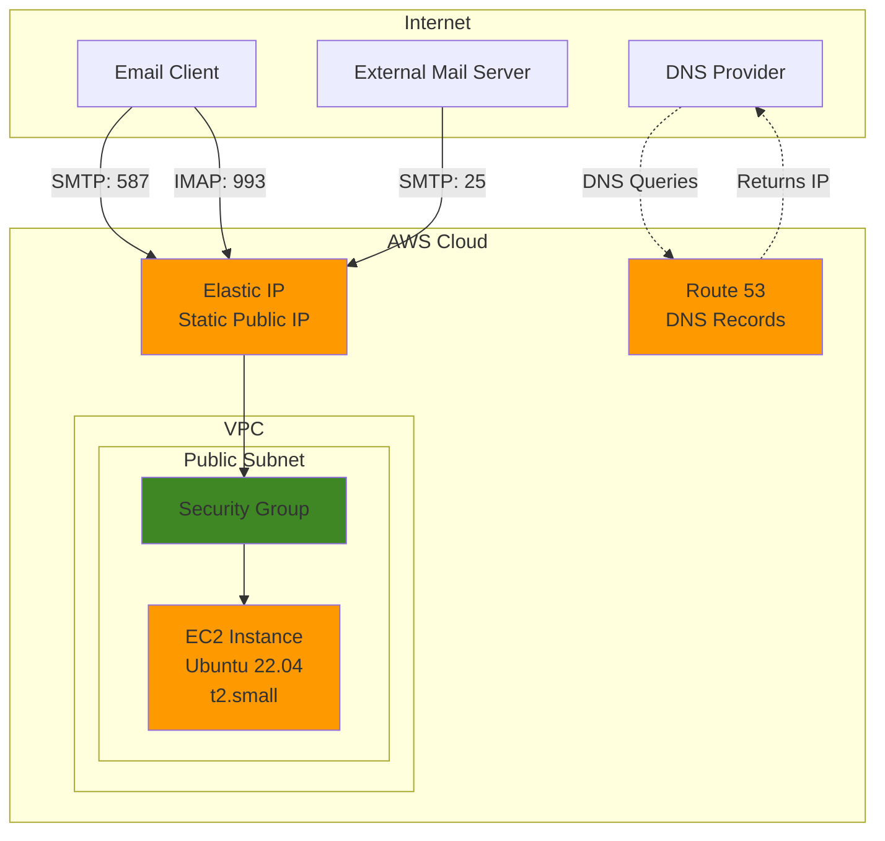
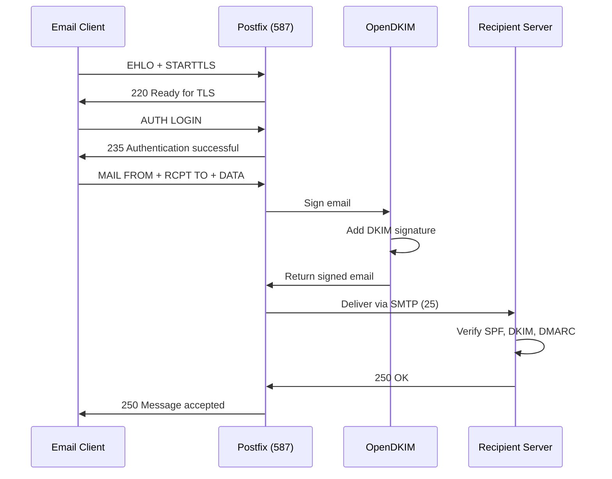
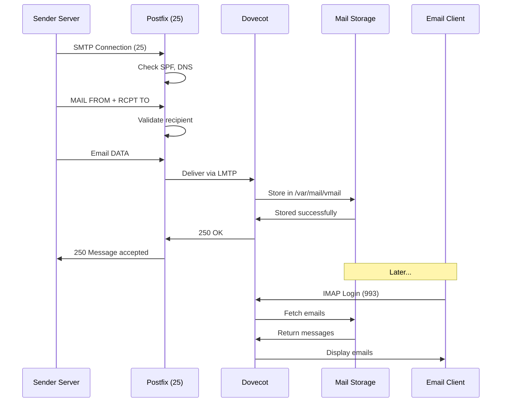
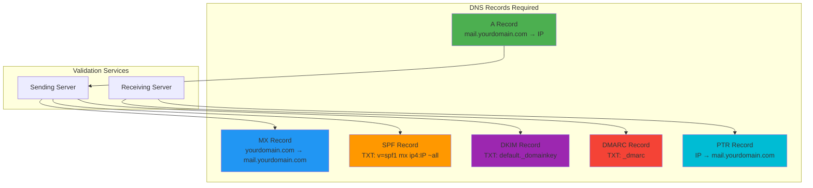
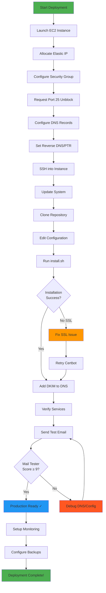
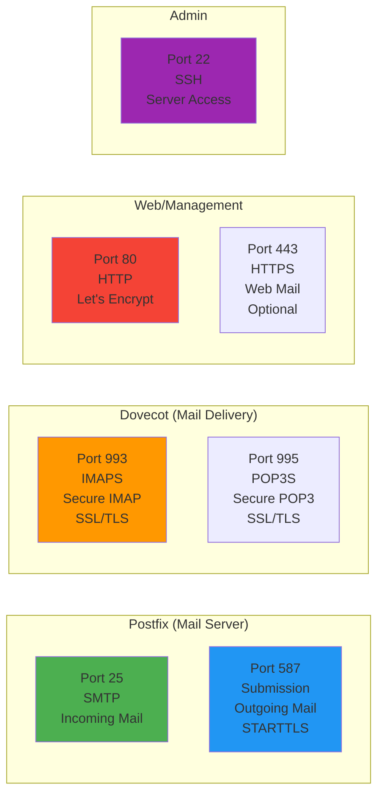
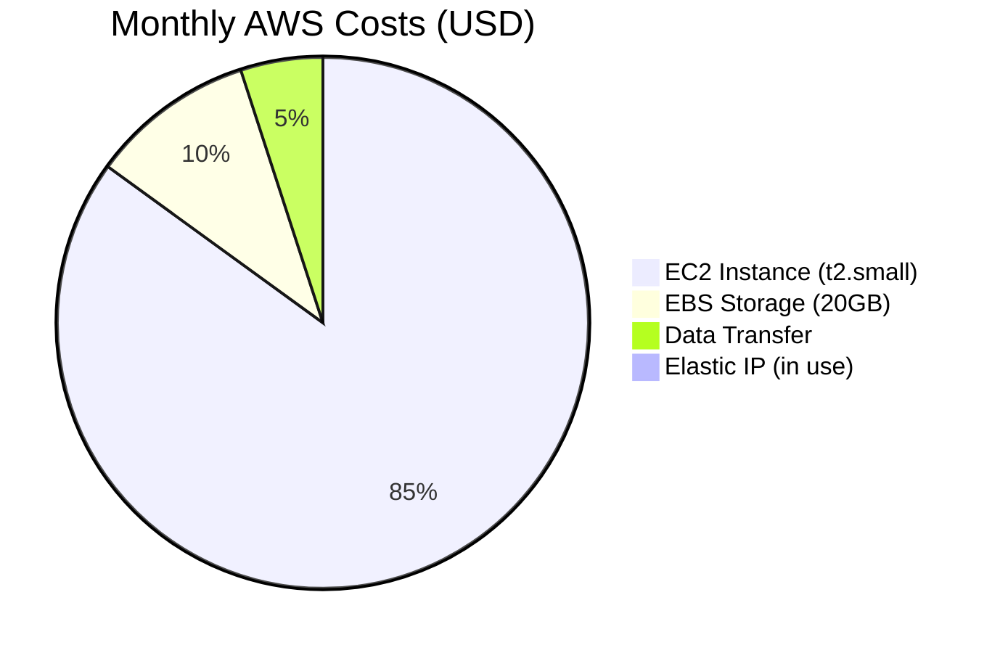
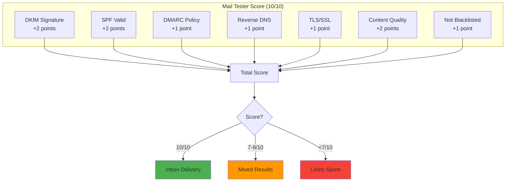

# Kings SMTP Architecture Diagrams

## AWS Infrastructure Overview



## Mail Server Components

```mermaid
graph LR
    subgraph "EC2 Instance: mail.yourdomain.com"
        subgraph "Incoming Email"
            SMTP25[Postfix<br/>Port 25<br/>SMTP]
        end
        
        subgraph "Outgoing Email"
            SMTP587[Postfix<br/>Port 587<br/>Submission]
        end
        
        subgraph "Email Delivery"
            Dovecot[Dovecot<br/>Port 993<br/>IMAP/POP3]
        end
        
        subgraph "Authentication"
            DKIM[OpenDKIM<br/>Email Signing]
            SASL[SASL<br/>Auth]
        end
        
        subgraph "Storage"
            MailDir[/var/mail/vmail]
        end
        
        subgraph "Security"
            SSL[Let's Encrypt<br/>SSL/TLS Certs]
            UFW[UFW Firewall]
        end
    end
    
    SMTP25 --> DKIM
    SMTP587 --> SASL
    SASL --> DKIM
    DKIM --> MailDir
    Dovecot --> MailDir
    SSL --> SMTP25
    SSL --> SMTP587
    SSL --> Dovecot
    
    style SMTP25 fill:#4CAF50
    style SMTP587 fill:#2196F3
    style Dovecot fill:#FF9800
    style DKIM fill:#9C27B0
    style SSL fill:#F44336
```

## Email Flow Diagram

### Sending Email (Outbound)



### Receiving Email (Inbound)



## DNS Configuration Flow



## Security & Authentication Flow

```mermaid
graph LR
    subgraph "Client Authentication"
        C1[Email Client]
        C1 -->|1. Connect| TLS[TLS/SSL<br/>Encryption]
        TLS -->|2. Encrypted| AUTH[SASL Auth]
        AUTH -->|3. Username/Password| DB[User Database]
        DB -->|4. Validated| SEND[Send Email]
    end
    
    subgraph "Email Signing"
        SEND -->|5. Add Headers| SIGN[DKIM Signing]
        SIGN -->|6. Private Key| KEY[/etc/opendkim/keys]
        KEY -->|7. Signed| OUT[Outbound Email]
    end
    
    subgraph "Recipient Verification"
        OUT -->|8. Send| REC[Recipient Server]
        REC -->|9. Verify DKIM| DNS1[DNS: DKIM Public Key]
        REC -->|10. Verify SPF| DNS2[DNS: SPF Record]
        REC -->|11. Check DMARC| DNS3[DNS: DMARC Policy]
        DNS1 --> DECISION
        DNS2 --> DECISION
        DNS3 --> DECISION[Accept/Reject<br/>Decision]
        DECISION -->|Pass| INBOX[Inbox]
        DECISION -->|Fail| SPAM[Spam/Reject]
    end
    
    style TLS fill:#F44336
    style SIGN fill:#9C27B0
    style INBOX fill:#4CAF50
    style SPAM fill:#FF5722
```

## AWS Deployment Workflow



## Port and Protocol Reference



## File System Structure

```
/
├── etc/
│   ├── postfix/
│   │   ├── main.cf              # Main Postfix config
│   │   ├── master.cf            # Service definitions
│   │   └── virtual              # Virtual aliases
│   ├── dovecot/
│   │   ├── dovecot.conf         # Main Dovecot config
│   │   ├── conf.d/
│   │   │   ├── 10-auth.conf    # Authentication
│   │   │   ├── 10-master.conf  # Services
│   │   │   └── 10-ssl.conf     # SSL/TLS
│   │   └── users                # Email user database
│   ├── opendkim/
│   │   ├── opendkim.conf        # DKIM config
│   │   ├── TrustedHosts         # Trusted relay hosts
│   │   └── keys/
│   │       └── yourdomain.com/
│   │           ├── default.private  # Private key (keep secret!)
│   │           └── default.txt      # Public key (add to DNS)
│   └── letsencrypt/
│       └── live/
│           └── mail.yourdomain.com/
│               ├── fullchain.pem    # SSL certificate
│               └── privkey.pem      # Private key
└── var/
    ├── mail/
    │   └── vmail/
    │       └── yourdomain.com/
    │           └── admin/           # Email storage
    │               ├── cur/
    │               ├── new/
    │               └── tmp/
    └── log/
        ├── mail.log                 # Main mail log
        └── letsencrypt/
            └── letsencrypt.log      # SSL cert logs
```

## Cost Breakdown (AWS)



**Total: ~$20/month**

## Email Deliverability Score Components



---

## Legend

- **Orange boxes**: AWS services
- **Green boxes**: Mail receiving
- **Blue boxes**: Mail sending
- **Purple boxes**: Security/Authentication
- **Red boxes**: SSL/TLS encryption

## Useful Links

- [AWS EC2 Pricing](https://aws.amazon.com/ec2/pricing/)
- [Let's Encrypt Rate Limits](https://letsencrypt.org/docs/rate-limits/)
- [Postfix Documentation](http://www.postfix.org/)
- [OpenDKIM Configuration](http://opendkim.org/)
- [RFC 5321 - SMTP](https://tools.ietf.org/html/rfc5321)
